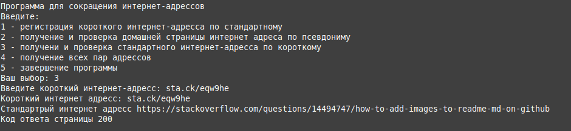
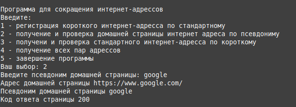
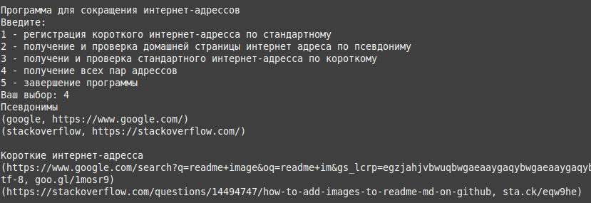
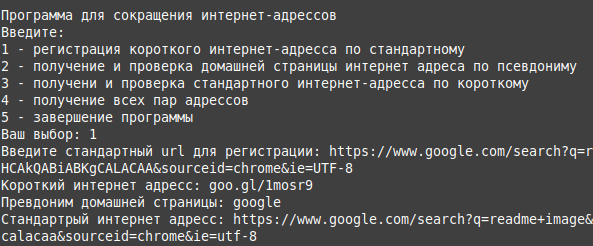
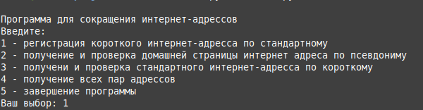

# shoturlconsole

Service for URL shortening as a console application

App test in python 3.10

To start application you need run main.py

curent:
+ main.py (main module. start application)
+ settings.py (module with settings)

utils:
+ cut.py (module to generate shot url)
+ messages.py (module for print information)
+ regex.py (module for parsing web url)
+ storage.py (module to storage data)

screenshot:

